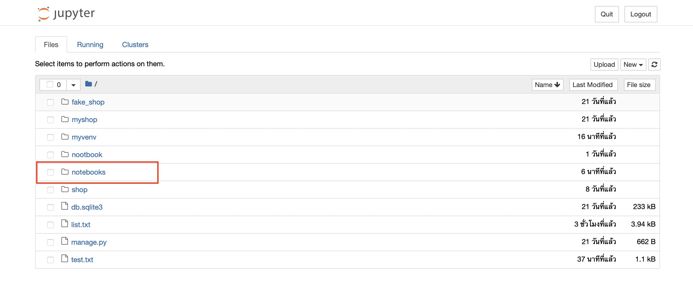

# Using Django in Jupyter Notebook

การใช้งาน Django ใน Jupyter Notebook สามารถทำตามขั้นตอนดังนี้

1. ติดตั้ง virtualenv โดยกำหนด version ของภาษา python ดั่งนี้

    สำหรับ Windows
    ```sh
    py -m venv myvenv
    ```

    สำหรับ MAC OS
    ```sh
    python3 -m venv myvenv4
    ```

    activate และติดตั้ง Django และ psycopg2
    ```sh
    pip install django psycopg2-binary
    ```

2. สร้าง project Django

3. ติดตั้ง `django-extensions` และ `jupyter notebook` ด้วยคำสั่ง

    ```sh
    pip install django-extensions ipython jupyter notebook   
    ```

4. จากนั้นให้แก้ไข version ของ package ภายใน jupyter และ notebook

    ```sh
    pip install ipython==8.25.0 jupyter_server==2.14.1 jupyterlab==4.2.2 jupyterlab_server==2.27.2
    ```

    แก้ไข version notebook
    ```sh
    pip install notebook==6.5.7
    ```

5. จากนั้นสร้าง directory ชื่อ `notebooks`

    ```sh
    mkdir notebooks
    ```

6. เพิ่ม `django-extensions` ใน INSTALLED_APPS ในไฟล์ settings.py

    ```python
    INSTALLED_APPS = [
        "django.contrib.admin",
        "django.contrib.auth",
        "django.contrib.contenttypes",
        "django.contrib.sessions",
        "django.contrib.messages",
        "django.contrib.staticfiles",
        "django_extensions",
        "blogs",
    ]
    ```

7. ทำการ start Jupyter Notebook server ด้วย command 

    ```sh
    python manage.py shell_plus --notebook
    ```

ซึ่งจะเปิด Jupyter Notebook ขึ้นมาใน Web Browser

8. เข้าไปที่ folder `notebooks`

    

9. สร้าง ไฟล์ ipynb สำหรับใช้กับ project django

    

10. จากนั้นใน Cell แรกของไฟล์ Notebook เพิ่ม code นี้ลงไป

    ```python
    import os
    os.environ["DJANGO_ALLOW_ASYNC_UNSAFE"] = "true"
    ```

    


11. สามารถทำการ import models และ query ข้อมูลโดยใช้ API ของ Django ได้เลย

```python
from blogs.models import Blog

for blog in Blog.objects.all():
    print(blog)
```

12. ลองเพิ่มข้อมูลเข้าไปในทุกตารางเลยครับ จากนั้นลอง query ข้อมูลดู
